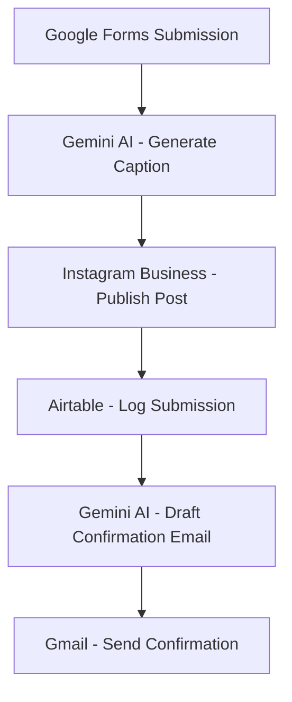
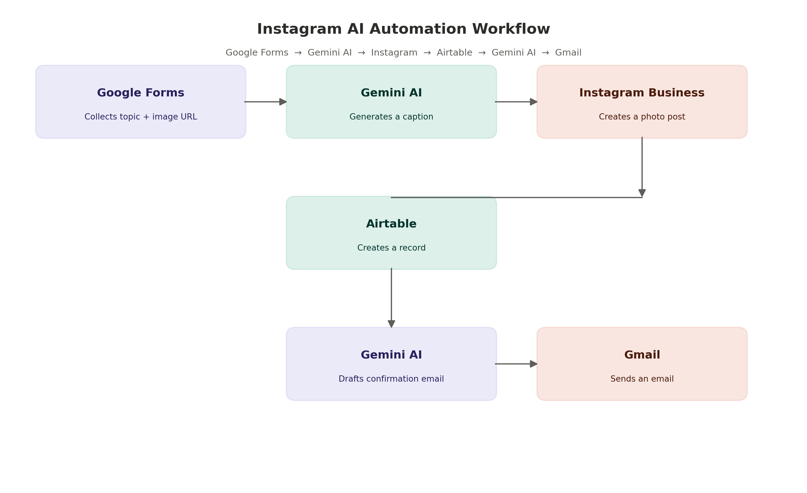
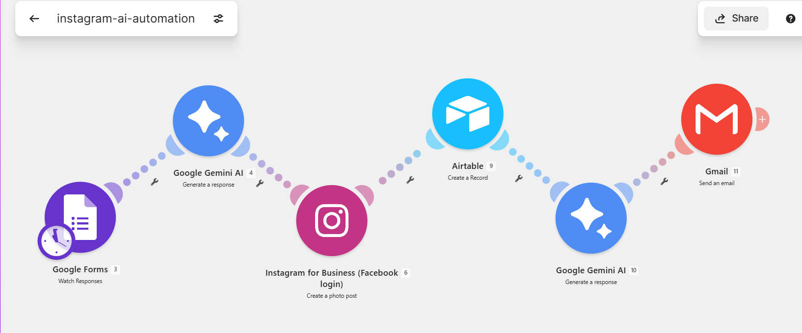

# Instagram AI Automation


An automated, AI-powered Instagram content pipeline built with Make.com. Anyone can submit a topic through a simple form — Google Gemini AI writes the caption, the post goes live on Instagram, the submission is logged for record-keeping, and the submitter gets a friendly confirmation email, all without a single manual step.

---

## ❗ Problem Statement

Posting consistently on Instagram takes more than just writing an idea down. Someone still has to turn that idea into a caption, publish the post, keep a record of what was posted and when, and let the requester know it's live. Done manually — over and over, for every submission — this quickly eats up time that could go toward other work, and it's easy for a step to get missed.

## ✅ Solution

This project removes the manual work entirely. A single Google Form submission triggers a Make.com scenario that writes the caption with Gemini AI, publishes the post to Instagram, logs the submission in Airtable, and emails a confirmation back to the submitter — end to end, with no human step in between.

---

## 🔎 Overview

When someone submits the onboarding form, the scenario:

1. **Watches for new form responses** (Google Forms) — Full Name, Topic, Image URL, and Gmail address.
2. **Generates a caption** — Google Gemini AI writes a short, engaging 2–3 line caption with 2 relevant hashtags based on the submitted topic.
3. **Publishes the post** — the caption and image are posted to Instagram Business.
4. **Logs the submission** — the full record (name, topic, image URL, email) is saved to Airtable for tracking.
5. **Drafts a confirmation email** — a second Gemini AI call writes a short, friendly email referencing the published Post ID.
6. **Sends the email** — Gmail delivers the confirmation straight to the submitter's inbox.

Every submission — start to finish — is handled automatically, with zero manual posting or emailing required.

---

## 🏗️ Architecture



---

## 🖇️ Workflow Diagram



## ⚙️ Make.com Scenario



---

## ✨ Features

- Collects submissions through a simple Google Form
- Generates human-sounding Instagram captions with Google Gemini AI
- Automatically publishes photo posts to Instagram Business
- Logs every submission in Airtable for easy tracking
- Sends a personalized, AI-written confirmation email per post
- Fully automated Make.com scenario — no coding required
- Two independent Gemini AI prompts (caption vs. email), kept as separate, editable files

---

## 🛠️ Tools Used

| Service | Purpose |
|---|---|
| Google Forms | Collects topic, image URL, and submitter details |
| Google Gemini AI | Generates the caption and the confirmation email copy |
| Instagram Business (Facebook Login) | Publishes the photo post |
| Airtable | Stores a record of every submission |
| Gmail | Sends the confirmation email |
| Make.com | Orchestrates the entire scenario |

---

## 📋 Prerequisites

Before setting this up, make sure you have:

- A **Make.com** account (free tier works for testing)
- A **Google account** with access to Google Forms and Airtable
- A **Google Gemini API key** from [Google AI Studio](https://aistudio.google.com/)
- An **Instagram Business account** connected to a Facebook Page
- A **Facebook Developer app** with Instagram Graph API access, for the Instagram module login
- A **Gmail account** to send confirmation emails from

---

## 📁 Repository Structure

```
instagram-ai-automation/
├── README.md
├── LICENSE
├── .gitignore
├── instagram-ai-automation.blueprint.json   # Make.com scenario export
├── docs/
│   ├── workflow-diagram.png
│   ├── scenario-diagram.png
│   ├── google-form.png
│   ├── instagram-post.png
│   ├── airtable.png
│   └── gmail-notification.png
└── prompts/
    ├── caption-generation-prompt.md
    └── email-confirmation-prompt.md
```

---

## 🖼️ Project Screenshots

- [Google Form](docs/google-form.png) — the intake form submitters fill out
- [Instagram Post](docs/instagram-post.png) — an example published post
- [Airtable Log](docs/airtable.png) — submission records
- [Gmail Confirmation](docs/gmail-notification.png) — the confirmation email a user receives

---

## 🧠 AI Prompts

This scenario uses two distinct Gemini AI prompts, kept as separate files for clarity:

- [`prompts/caption-generation-prompt.md`](prompts/caption-generation-prompt.md) — turns the submitted topic into a short caption + 2 hashtags
- [`prompts/email-confirmation-prompt.md`](prompts/email-confirmation-prompt.md) — turns the published Post ID into a friendly confirmation email

---

## ⚙️ Setup / Replication

1. Create a Google Form with the fields: **Full Name**, **Topic**, **Image URL**, **Gmail**.
2. Import `instagram-ai-automation.blueprint.json` into Make.com.
3. Reconnect the Google Forms, Gemini AI, Instagram Business, Airtable, and Gmail modules to your own accounts.
4. Update the two prompts in `prompts/` with your own brand voice, if desired.
5. Turn the scenario on.

---

## 📌 Notes

- Submitter data (names, emails, image URLs) is **not stored in this repository** — only the automation logic, prompts, and documentation.
- Replace any placeholder links or sample data above with your own live form and records.

---

## 🚀 Future Improvements

- Multi-platform posting (Facebook, LinkedIn, X)
- AI-generated images instead of user-submitted URLs
- Analytics dashboard for post performance
- Slack/Discord notifications alongside email
- Scheduled posting instead of instant publish

---

## 📜 License

This project is licensed under the [MIT License](LICENSE).

⭐ If you found this project useful, consider giving it a star.